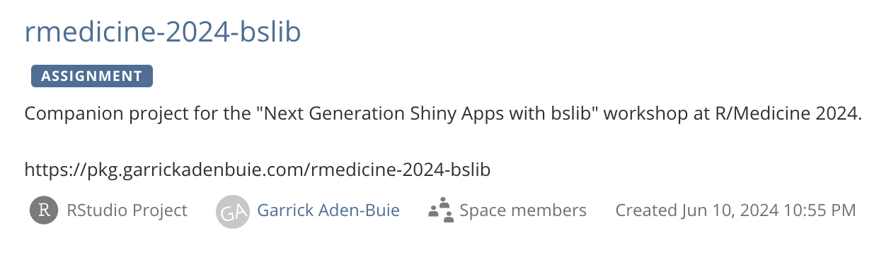
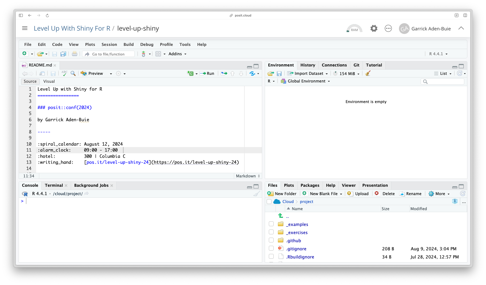

## Welcome to Level&nbsp;Up&nbsp;with Shiny&nbsp;for&nbsp;R

* Take a seat, etc.
* Here's an important link
* WiFI info

```{=html}
<style>
.reveal .footer {
  font-size: 1em !important;
}
</style>
```

# 🤝 Introductions 🤝 {.middle}

## Meet us

- Garrick
- Carson
- Barret
- Kalau
- Andrew

## Code of Conduct

**Please Review:** [posit.co/code-of-conduct](https://posit.co/code-of-conduct/)

💙 Treat everyone with respect \
🧡 Everyone should feel welcome and safe

**Reporting:**

🗣️ any posit::conf staff member (t-shirt) or Info desk \
📧 `conf@posit.com`

## Meet each other

TK: activity

# About this workshop {.middle}

## WiFi {.text-center .middle}

::: {.fs-step-3 style="min-width: 500px"}
| WiFi | Posit Conf 2024 |
|------|-----------------|
| Pass | `conf2024`      |
:::


## posit::conf(2024) Things to Know

::: incremental
* There will be a gender-neutral bathroom on levels `3:7`
* Meditation/prayer room: 503
    * Mon & Tues 7am - 7pm
    * Wed 7am - 5pm
* Mothers room: 509
:::

## posit::conf(2024) Social Media

* [Red lanyards]{.red .b} available to those who don't wish to be photographed

* `#PositConf2024` for all things conf

* `#LevelUpShiny` for this workshop


## Stickies

::: {.flex style="margin-top: var(--space-xl); font-size: var(--step-3);"}
::: {.flex .flex-column .items-center .justify-center .w-50 .text-center}
🟩

All good \
I'm done
:::
::: {.flex .flex-column .items-center .justify-center .w-50 .text-center}
🟥

Not great \
Need time or help
:::
:::


## Schedule



## Schedule

::: {.table-highlight-even}

:::

<!-- TODO another table with activity and break times highlighted -->

## Discord

Go [posit.co/conference](https://posit.co/conference), click **Login**.
Click image to connect to the `posit::conf()` Discord server.

This workshop has a private channel under Workshops.

::: {.text-center .code .purple}
#level-up-shiny
:::


Great place to ask questions, post resources, memes, or most anything else before, during, and after the workshop.


# Computational Environment {.middle}

## Posit Cloud

::: {.fs-step-3}
**Step 1.** Join
<!-- FIXME: cloud link -->[pos.it/level-up-shiny-24](https://pos.it/level-up-shiny-24)

::: fragment
**Step 2.** Start `level-up-shiny` assignment

::: text-center
{width="80%"}
:::
:::
:::


## Cloud session {.text-center}

{style="max-height: 700px"}


## File organization

::: {.table-no-border style="--row-padding: var(--space-xs);"}
|  |  |
|:---|:------------|
| `_exercises/` | Files for **Your Turn** exercises |
| `_examples/` | Files for my demo examples |
| `website/` | The website and slides |
| `./*` | Lots of project related files you can ignore |
:::

# Let's Dive In! {.middle}
