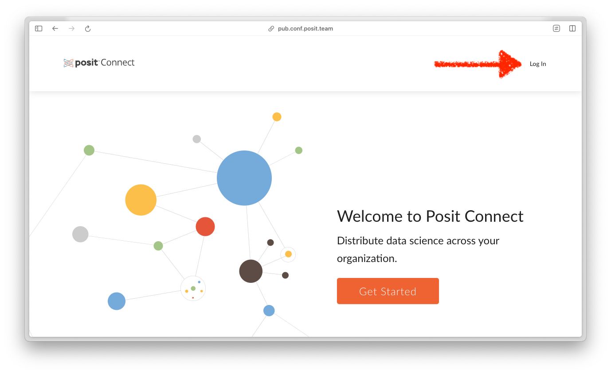
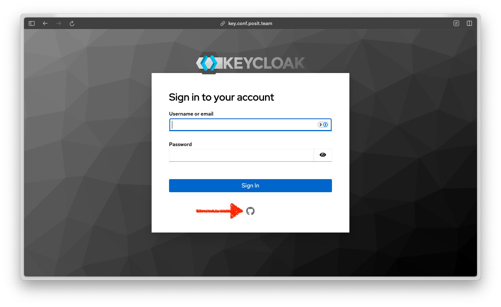
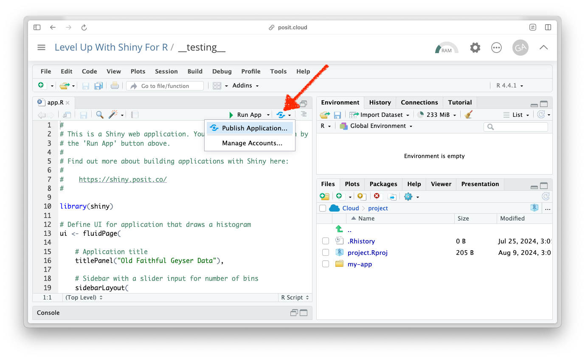
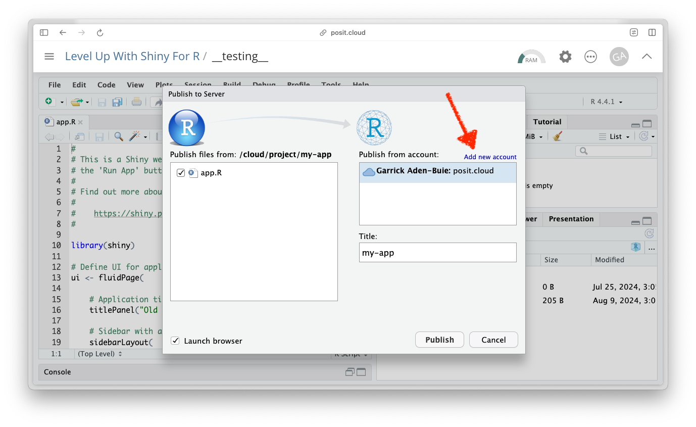
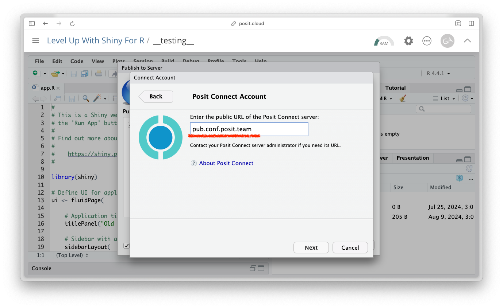
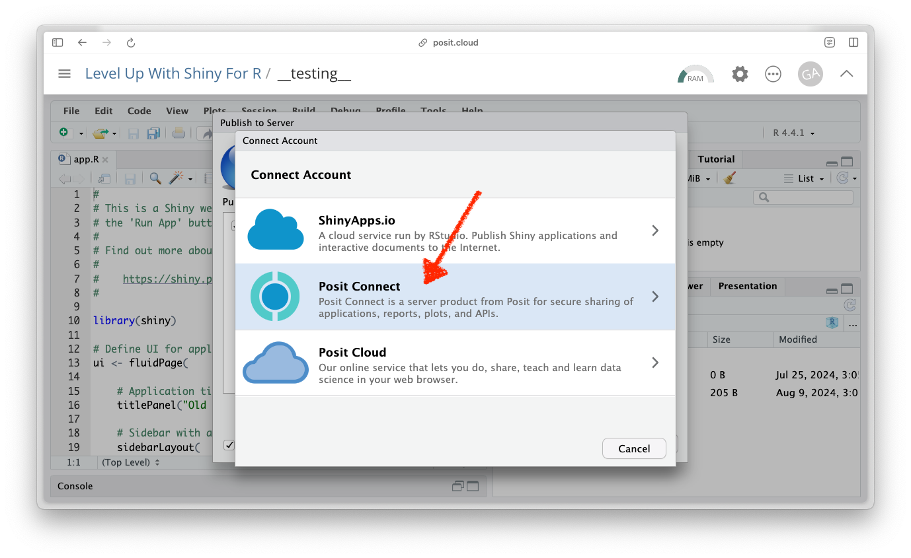
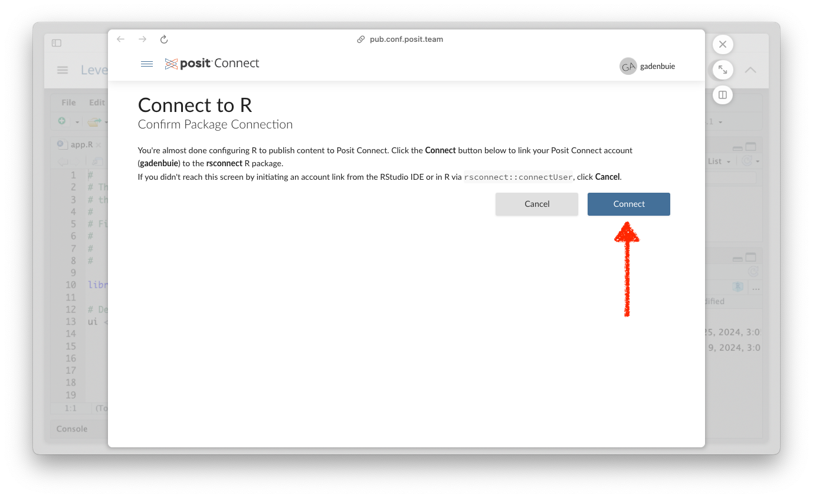
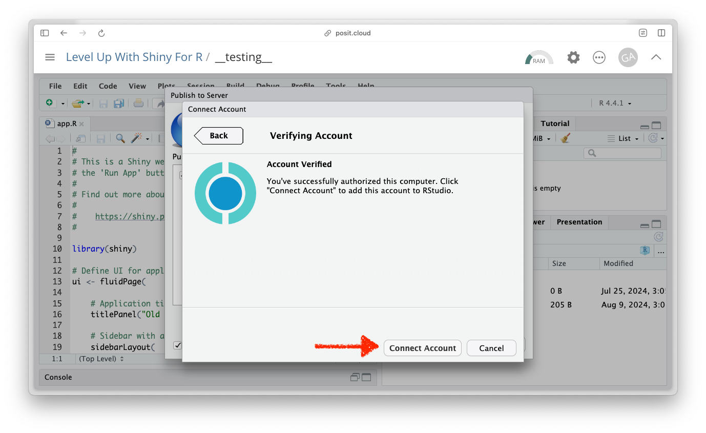
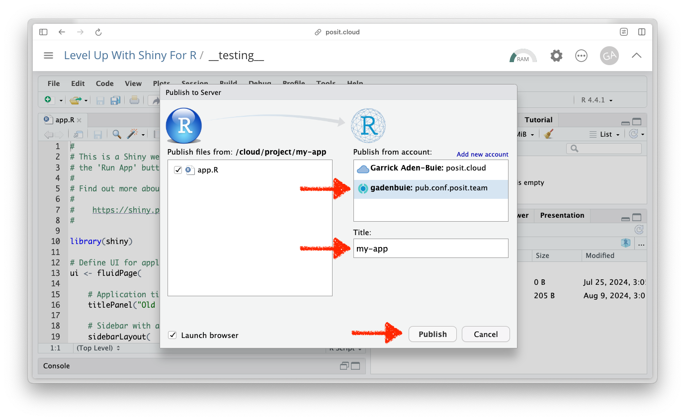

## Slides



## Connecting RStudio with Connect

**Step 1**: Open [pub.conf.posit.team](https://pub.conf.posit.team) and click the "Log In" button.

{style="max-height: 450px"}

**Step 2**: Log in with your GitHub account.

{style="max-height: 450px"}

**Step 3**: With the app to deploy open, click on the "Publish Application" button.

{style="max-height: 450px"}

**Step 4**: This opens the "Publish to Server" dialog, but your `pub.conf.posit.team` account isn't connected, yet. Click "Add new account".

{style="max-height: 450px"}

**Step 5:** Enter `pub.conf.posit.team` for the public URL of the Posit Connect server.

{style="max-height: 450px"}

**Step 6:** Select "Posit Connect" from the account type menu.

{style="max-height: 450px"}

**Step 7:** This opens a new window on https://pub.conf.posit.team. From here, click "Connect" to connect Posit Cloud with Posit Connect.

{style="max-height: 450px"}

**Step 8:** Return to Posit Cloud and click "Connect Account" to add the account to RStudio.

{style="max-height: 450px"}

**Step 9:** Chose the newly added `pub.conf.posit.team` account, give your app a title, and click Publish to kick off the publish step!

{style="max-height: 450px"}

**Great work!** Give yourself a pat on the back. Check on your neighbors to see if they need help getting set up.